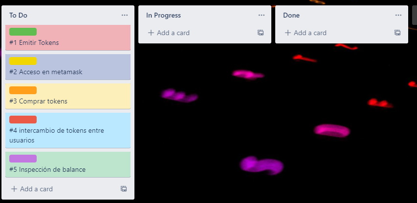
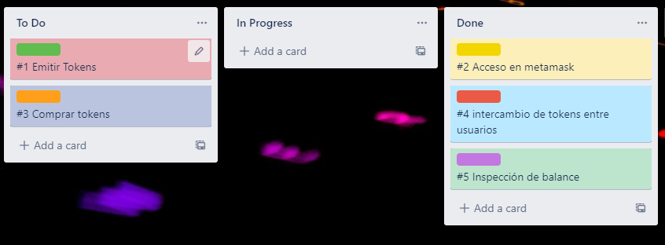

# Backend

### 11/11/2021
Se empezo creando un tablero de Trello con las siguientes tareas:

Sin embargo, nos dimos cuenta que de esas tareas iniciales, varias ya se encontraban hechas. Algunas porque la propia implementacion de OpenZeppeling ya trae muchas funcionalidades que podemos utilizar y otras por los progresos que hicimos los primeros dias trabajando todo el equipo junto.

Entonces el estado paso a este:

Conmenzamos a trabajar en la funcionalidad de emitir un Token pero luego de no lograr hacerla funcionar y por feedback de los profesores, decidimos descartar tal funcionalidad y quedarnos con un sistema basico que genere una cantidad fija de tokens al comenzar y no se puedan emitir nuevos.

Esto hizo que el progreso del dia fuera muy poco, pero nos dio la oportunidad de investigar un poco más ERC20 y como funciona. El objetivo para el proximo dia de trabajo será implementar la funcionalidad que falta y volver a hacer una revision de los requerimientos para encontrar mas funcionalidades en las que debemos trabajar.