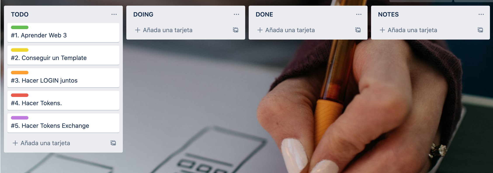
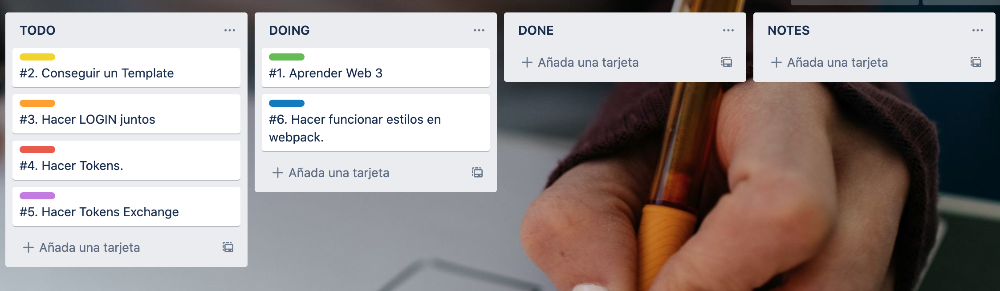
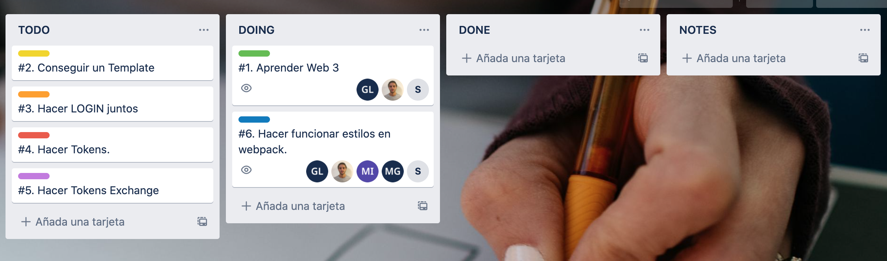
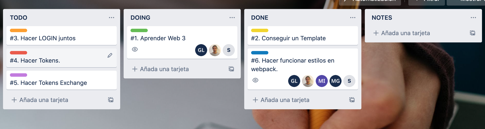
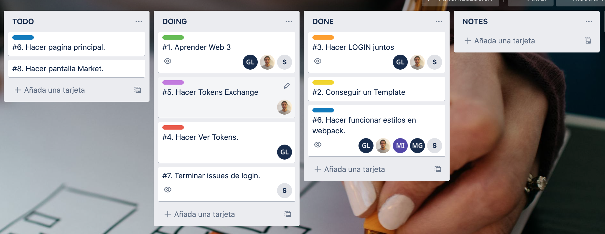
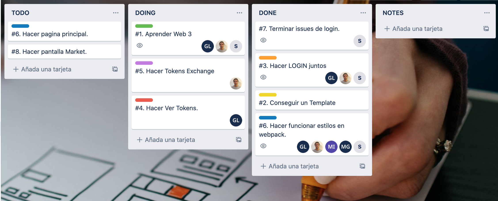

### Front End

### 11/11/2021
Se empezo creando un tablero de Trello con las siguientes tareas:

Decidimos empezar buscando un Template, luego a este template le aplicariamos cambios para acercarnos a nuestros prototipos deseados. De esta manera, aprenderiamos Web3 y de paso armariamos el login juntos para luego poder hacer las otras pantallas por separado.

Sin embargo, cuando empezamos a aplicar el template, nos saltaron muchos errores y nos dimos cuenta que primero debiamos hacer funcionar los estilos en webpack.

Se intento durante el resto del dia poder hacer funcionar los estilos en webpack, pero no se pudo lograr el cometido. Quedo subido un issue al respecto.

El estado final del Trello fue el siguiente:

### 18/11/2021
Se continuo intentando hacer funcionar el template. Pero fue una pared de errores. El equipo se vio reducido por factores externos como entregas de otras materias.
No se pudo concretar ni solucionar los errores relacionados al funcionado de las paginas de estilos en Webpack.

El tablero de trello no tuvo modifcaciones.

### 23/11/2021
Luego de muchas entregas, el equipo se puso de vuelta en marcha para avanzar en el proyecto.

El primer tema grande por resolver era el del template y del aplicado de estilos en Webpack. Para esto, el equipo entero (Front y Back) se pusieron en marcha para resolver el problema. Decidimos incluir al Backend en el problema ya que era algo que sabiamos que tenia que solucionarse lo antes posible, creemos que una pagina con un buen look aporta mucho a la usabilidad, incluso si no es funcionalidad pura y dura. Aun asi, estabamos prontos para dejar de lado el problema si consumia demasiado tiempo.

El tablero de Trello, en este momento, se veia asi:

La estrategia dio frutos ya que la solucion fue encontrada por un miembro del equipo de Backend, fueron de mucha ayuda y nos puso en marcha en realmente implementar las paginas.

Luego de solucionar el problema y de encontrar un template bueno, el tablero se veia asi:

Empezamos inmediatamente con la tarea de realizar el Login juntos, para poder establecer las bases e ideas comunes a todas las paginas. El avance fue bueno y el template fue muy util. Se establecio una pagina de Login que funciona como Landing Page para informacion basica sobre la aplicacion. El login, luego, seria filtrado por Metamask. La pagina fue terminada, pero quedo con un issue registrado en Github.

Luego de terminada la pagina de Login, el grupo se ocupo de dividir el resto de las pantallas para esta primera mitad del trabajo. Se tuvo que agregar nuevas tareas al tablero de Trello, pero ya estabamos trabajando en paralelo y de manera eficiente:

GL: Gaston Landeira, S: Iñaki Etchegaray y Marcos Novelli con su foto, los miembros del Frontend.

La pagina relacionada al Exchange de Tokens avanzo mucho, con algunas cosas por verse para concretar su funcionamiento.

Fue un dia muy productivo que permitio avanzar mucho al equipo.

### 24/11/2021
Hubieron cientos de avances hoy, dado que el template ya no era un problema, nos concentramos en implementar las paginas. Antes de ir a trabajar con eso, sin embargo, se intento separar los archivos js en distintos archivos js.

Despues de intentar mucho con webpack, agregando distintos loaders y plugins de versiones nuevas y anteriores, no logramos separar los archivos js, ya que no era posible conseguir la informacion obtenida en el primer HTML. Por lo tanto, no tuvimos otra que componer toda la funcionalidad en un mismo archivo js y consultar a la blockchain cada vez que se queria utilizar una funcionalidad que requiera la blockchain.

Luego de resolver eso, se comenzo a implementar las paginas. El trello este dia comenzo asi:

El equipo se enfoco en cada uno terminar una pagina respectivamente:
[image info](./images/frontend/24-Nov-2.png)

Cada página quedo implementada con los botones, los inputs y la estética deseada, la resolución fue sumamente rapida. Luego solo quedaba una pantalla para completar la primera funcionalidad grande. Dos integrantes del equipo se encargaron de implementar esa ultima pagina mientras otro se encargaba de implementar las funcionalidades prontas del backend con el frontend.

Progreso del tablero en este tiempo:
[image info](./images/frontend/24-Nov-3.png)
[image info](./images/frontend/24-Nov-4.png)
[image info](./images/frontend/24-Nov-5.png)
[image info](./images/frontend/24-Nov-6.png)

Finalmente el tablero quedo de la siguiente manera:
[image info](./images/frontend/24-Nov-7.png)

Las implementaciones con el backend eran simples y fueron rapidas. Una vez terminada la ultima pantalla, el equipo se junto con backend para ver avances.

Luego de ver los avances de backend, se vio de empezar a implementar la ultima gran funcionalidad de la primera parte del proyecto: el Exchange. Esta funcionalidad aun no estaba pronta del backend. Igual se decidio vincular las funcionalidades para tener eso pronto:
[image info](./images/frontend/24-Nov-8.png)

Aun así, no se dio por terminada la tarea ya que las cosas del backend aun no estaban prontas. Para el próximo día, se decidió definir las tareas para la segunda gran funcionalidad.

### 25/11/2021
Luego de presentar los avances del proyecto, el equipo de frontend se encargo de seguir avanzando y corregir algunas cosas anotadas en la presentacion.

Se agrego en el header de la pagina, un label que indica la cuenta ingresada presentemente. Ademas, se arreglo unos errores de formato en la muestra del balance de la cuenta. Ademas, se arreglaron unos bugs visuales de las cartas en Exchange. Falta hacer este arreglo en las cartas de las otras paginas.

Estas pequeñas tareas no fueron anotadas en el Trello, pero fueron realizadas por Gastón Landeira.

Luego se decidio realizar una pagina nueva para el Admin de la aplicacion (los dueños de la empresa), los cuales pueden adaptar el precio de la moneda Event Token. Se agrego la tarea al trello y fue asignada:
[image info](./images/frontend/25-Nov-1.png)

Durante el resto del dia, se logro realizar la funcionalidad del Admin.
[image info](./images/frontend/25-Nov-2.png)

Los avances no fueron enormes, pero fueron sustanciales.

### 30/11/2021
El equipo de frontend discutio los pasos siguientes a tomar. Dado que el backend aun esta intentando hacer funcionar las partes de la moneda en si, el frontend decidio seguir trabajando en las pantallas restantes. Luego, una vez terminados, el equipo de frontend puede juntarse al de backend para lograr concluir las funcionalidades.

En un principio, se definieron las tareas restantes para las funcionalidades de Voting:
[image info](./images/frontend/30-Nov-1.png)

Luego el equipo se tomo un descanso para luego empezar a trabajar. Lamentablemente, algunos de los miembros tuvieron problemas tecnicos y nos tuvimos que separar en el trabajo por realizar. Cada uno se iba a asignar la pantalla deseada y la realizaria.

La primera asingacion fue realizada:
[image info](./images/frontend/30-Nov-2.png)

Y completada al rato, para luego realizar otra asignacion:
[image info](./images/frontend/30-Nov-3.png)
La cual fue concretada:
[image info](./images/frontend/30-Nov-4.jpg)

Pero esto siguio con otros integrantes asignandose y avanzando cuando podian:

Lugo de concretada al página de creación de votos, e creó la tarea de modificación de la alineación horizzontal del resumen de la cuenta en el nav bar:
[image info](./images/frontend/30-Nov-5.jpg)

También se agregó la tarea de explicitar el seguimineto de la navegabilidad a lo largo de toda la página:
[image info](./images/frontend/30-Nov-6.jpg)

Se agrega, también, la tarea de la modificación de la visualización del formulario para crear una nueva papeleta de votación:
[image info](./images/frontend/30-Nov-7.jpg)

Ahora ya habiendo reorganizado el trello explicitando todas las tareas identificadas hasta el momento y creando checklists en tarjetas para un mallor nivel de granularida en las tareas,  se procede a solucionar las mismas. Se comienza con la creación de la página de visualización de "myBallots":
[image info](./images/frontend/30-Nov-8.jpg)
Es importante destacar que el avance en esta página fue lento y muy importante ya que los elementos como tablas o cargada de datos, entre otros, se hicieron de tal manera que puedan ser reutilizables en otras pantallas. Para entrar un poco más en detalle, las tablas y textos informativos se crean directamente en el .js para que los datos de las mismas dependan de elementos solicitados al backend dependiendo de lo que se quiera hacer. 
También se decide no utilizar bootstrap en elementos creados en el .js por inconvenientes en incorporar clases dentro del js. No hay problema en usarlo dentro del html, pero al querer usarlo en el js se complica (porque bootstrap usa jQuery y no se referencia al mismo desde el js). Eventos de visualización por ejemplo el mouseover o el mouseout son creados también en él .js al momento de refreshear la tabla.

Cumplidas las cuatro subtareas, se da por terminada esta implementación:
[image info](./images/frontend/30-Nov-9.jpg)
Las cuatro subtareas son las siguientes:
[image info](./images/frontend/30-Nov-9_2.jpg)

Así es como terminó noviembre para frontend.

### 01/12/2021
Bienvenido Diciembre! 
Hoy comenzamos con una reunión donde concluimos que el equipo de front end estaba bástante bien en tema tareas-tiempo faltante para la entrega. Por esto, decidimos que lo mejor sería apoyar al equipo de backend enviando, con tristeza, un miembro de nuestro equipo.

Paso siguiente, continuamos resolviendo tareas establesidas en el trello. Comenzamos por el crear la pá gina de visualización de todas las pepeletas de votación:
[image info](./images/frontend/1-Dic-1.jpg)

Habiendo terminado cuatro de las cinco subtareas, decidimos continuar con otra diferente (a modo de hotfix) que es el arreglar todas las referencias a otros .html:
[image info](./images/frontend/1-Dic-2.jpg)
Rapidamente se solucionó este hotfix:
[image info](./images/frontend/1-Dic-3.jpg)

Descubrimos que la quita subtarea de pendiente ya estaba incluida en otra tarjeta aparte entonces la sacamos de la checklist y dimos por cumplida esta tarea:
[image info](./images/frontend/1-Dic-4.jpg)
Las cuatro subtareas son las siguientes:
[image info](./images/frontend/1-Dic-4_2.jpg)

Luego se comienza a implementar la función de votar en "allBallots":
[image info](./images/frontend/1-Dic-5.jpg)
Esta funcionalidad de implementa correctamente y con esto damos por teminado el día de hoy:
[image info](./images/frontend/1-Dic-6.jpg)

### 02/12/2021
Último día y en el equipo de front sabemos que vamos a llegar justo con los últimos detalles pero igualemnte decidimos que ni bién quede redondeado lo indispensable, un miembro de nuestro equipo de pasará a el equipo de back y/o redondeo de la documentación.

Comenzamos el día descubriendo que dejó de funcionar el evento de dobliclick para la pantalla "myBallots". Acto seguido, agregamos esta nueva tarea y nos pusimos a solucionar este contratiempo:
[image info](./images/frontend/2-Dic-1.jpg)
Pudimos solucionar este susto y volvimos al ruedo:
[image info](./images/frontend/2-Dic-2.jpg)

Continuamos con agregar el plaseholder de dobleclick en "allBallots"
[image info](./images/frontend/2-Dic-3.jpg)
Rapidamente, esto se puso solucionar y se comienza con la modificación de la visualización del panel de creación de una papeleta:
[image info](./images/frontend/2-Dic-4.jpg)

Al mismo tiempo se comienza con el arreglo de los decimales de la EVs en el resumen de cuenta en el nav bar:
[image info](./images/frontend/2-Dic-5.jpg)
Rapidamente se soliciona esto:
[image info](./images/frontend/2-Dic-6.jpg)

Se comienza corrige una tarea que no se habia pasado a done:
[image info](./images/frontend/2-Dic-7.jpg)
[image info](./images/frontend/2-Dic-8.jpg)

Se termina la modificación de la visualización de la creación de una la papeleta:
[image info](./images/frontend/2-Dic-9.jpg)

Se comienza a corregir el cambio de alineación horizontal del resumen de la cuenta en el nav bar:
[image info](./images/frontend/2-Dic-10.jpg)
Rapidamente esto se soluciona:
[image info](./images/frontend/2-Dic-11.jpg)

Se comienza a implementar el seguimiento de la navegabilidad a lo largo de toda la páginaÑ
[image info](./images/frontend/2-Dic-12.jpg)

Se comienzqa con una nueva tarea (a modo de hotfix) del dejar todos los títulos con el mismo formato:
[image info](./images/frontend/2-Dic-13.jpg)
Rapidamente esto se soluciona:
[image info](./images/frontend/2-Dic-14.jpg)

Por último, damos por solucionado el registro de la navegabilidad:
[image info](./images/frontend/2-Dic-15.jpg)

Damos por cerrado el trabajo de front end y nos juntamos con los de backend para terminar de conectar el front con el back.