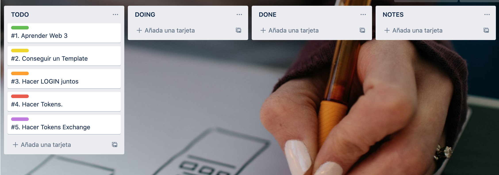
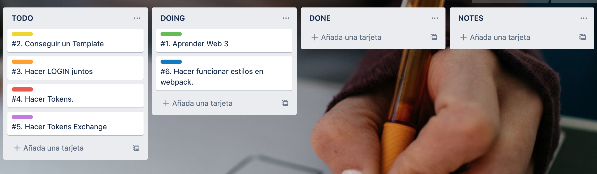

### Front End

### 11/11/2021
Se empezo creando un tablero de Trello con las siguientes tareas:

Decidimos empezar buscando un Template, luego a este template le aplicariamos cambios para acercarnos a nuestros prototipos deseados. De esta manera, aprenderiamos Web3 y de paso armariamos el login juntos para luego poder hacer las otras pantallas por separado.

Sin embargo, cuando empezamos a aplicar el template, nos saltaron muchos errores y nos dimos cuenta que primero debiamos hacer funcionar los estilos en webpack.

Se intento durante el resto del dia poder hacer funcionar los estilos en webpack, pero no se pudo lograr el cometido. Quedo subido un issue al respecto.

El estado final del Trello fue el siguiente:

### 18/11/2021
Se continuo intentando hacer funcionar el template. Pero fue una pared de errores. El equipo se vio reducido por factores externos como entregas de otra materia.
No se pudo concretar ni solucionar los errores relacionados al funcionado de las paginas de estilos en Webpack.

El tablero de trello no tuvo modifcaciones.

